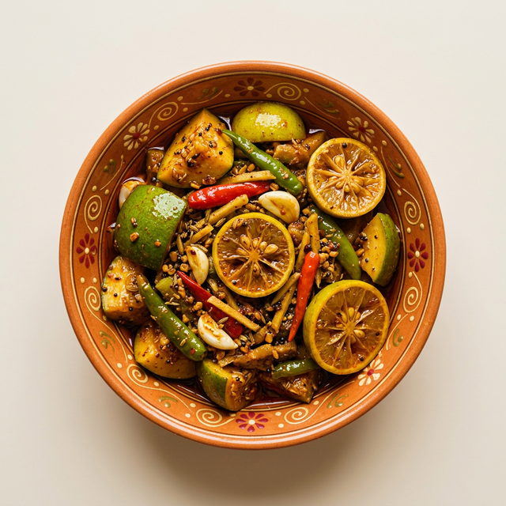

# Sri Vijaya Durga Pickles



A complete, production-ready business website for **Sri Vijaya Durga Pickles**, a homemade Andhra pickles and traditional garam masalas brand. This repository contains the source code for a fully functional, highly responsive, and beautiful static site built entirely with HTML, CSS, and vanilla JavaScript. 

## Features

- **Premium UI/UX:** Traditional Andhra food branding with a modern, elegant design.
- **WhatsApp Ordering System:** Direct, seamless order integration via WhatsApp with pre-filled messages.
- **Product Showcase:** Distinct sections for premium pickles (Chicken, Mutton, Prawns, etc.) and special Andhra Garam Masalas.
- **Smooth Animations:** High-performance scroll-reveal animations, dynamic hovers, and parallax effects.
- **Fully Responsive:** Mobile-first design perfectly optimized for devices of all sizes (desktop, tablet, mobile).
- **Performance Optimized:** Uses `loading="lazy"` on product imagery for fast content delivery.

## Product List

**Homemade Pickles:**
- Chicken Pickle (₹1040/kg)
- Chicken Boneless Pickle (₹1400/kg)
- Natukodi Pickle (₹1800/kg)
- Mutton Pickle (₹1800/kg)
- Chepala (Fish) Pickle (₹900/kg)
- Prawns Pickle (₹1800/kg)
- Boti Pickle (₹1400/kg)

**Special Andhra Garam Masalas:**
- Fish Garam Masala
- Mutton Garam Masala
- Chicken Garam Masala
- Prawn Garam Masala
- Mutton Fry Garam Masala

## Technologies Used

- **HTML5:** Semantic architecture
- **CSS3:** Custom properties (variables), Flexbox/Grid layouts, advanced keyframe animations.
- **JavaScript (ES6):** Intersection Observers for scroll reveals, mobile menu toggling, and parallax dynamic scrolling.
- **Deployment:** Ready for GitHub Pages & Vercel.

## Ordering Instructions

Orders are managed directly through WhatsApp for a quick, personal, and convenient customer experience. 

Customers simply click any **"Order Now"** or **"Chat with us Now"** button, and they will be redirected to WhatsApp:
`https://wa.me/918639677499?text=Hello%20I%20would%20like%20to%20order%20[ITEM]`

---

## Deployment Instructions

This website is a static site and can be deployed for free instantly.

### GitHub Web & CLI Deployment (Fastest Way)

Since your files are perfectly cleaned and ready, you can deploy in just 3 minutes:

1. Go to **github.com/bhanusai06** and create a NEW, empty repository.
2. Name the repository exactly: `sri-vijaya-durga-pickles`
3. Leave all boxes unchecked (Don't add a README or .gitignore). 
4. Click **Create repository**.

Now, open a terminal (like PowerShell, Command Prompt, or VS Code Terminal) inside your `Downloads\pickles` folder and paste this exact block of commands:

```bash
git remote add origin https://github.com/bhanusai06/sri-vijaya-durga-pickles.git
git branch -M main
git push -u origin main
```

**To make it live on the internet immediately after pushing:**
1. Go back to your new GitHub page: `github.com/bhanusai06/sri-vijaya-durga-pickles`
2. Click on **Settings** (the gear icon at the top right of the repo).
3. On the left sidebar, click **Pages**.
4. Under "Build and deployment", change "Source" to **Deploy from a branch**.
5. Change the Branch dropdown from "None" to **main**, keep the folder as `/ (root)`.
6. Click **Save**.

Within 1-2 minutes, GitHub will give you a live link at the top of that Settings > Pages screen. Your website is now permanently live!

### Vercel Deployment

1. Create a free account on [Vercel](https://vercel.com).
2. Click **Add New** -> **Project**.
3. **Import** the GitHub repository `sri-vijaya-durga-pickles`.
4. Vercel will automatically detect that it is a static HTML project.
5. Click **Deploy**.

The site will deploy instantly and Vercel will provide a live URL (e.g., `sri-vijaya-durga-pickles.vercel.app`).

---

### Developer Credit

Website Developed by **Bhanu Sai Veera Ashok Babu Sonti**  
Contact: +91 7989331212
